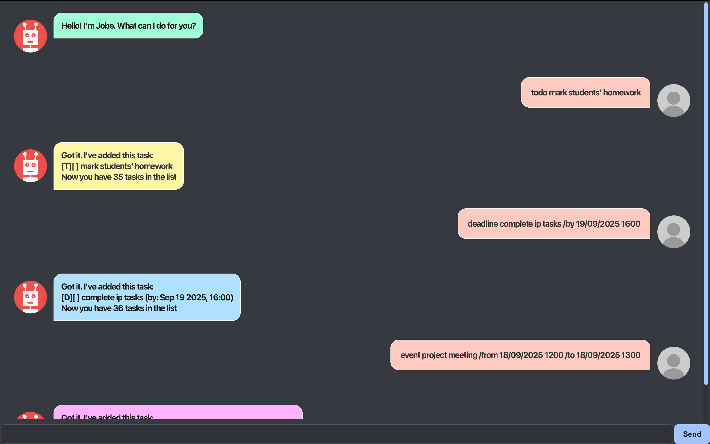

# Jobe User Guide

Jobe is a desktop app for managing your tasks, optimized for use via a Command Line Interface(CLI) while still having the benefits of a Graphical User Interface (GUI). If you can type fast, Jobe can get your task management done faster than traditional GUI apps.

# Quick start
1. Ensure you have Java 17 or above installed in your Computer.
   __Mac users:__ Ensure you have the precise JDK version prescribed here.

2. Download the latest .jar file.
3. Copy the file to the folder you want to use as the home folder for Jobe.
4. Open a command terminal, cd into the folder you put the jar file in, and use the java -jar jobe.jar command to run the application.  
   A GUI similar to the screenshot above should appear in a few seconds.
5. Type the command in the command box and press Enter to execute it.

Do refer to the features section below for detailed information of all the available features.

# Features

Note: Do follow the command format __EXACTLY__. Include spaces exactly where needed. 
Jobe will acknowledge your command if it is typed correctly.

## Adding Todo Tasks: `todo`

Adds a Todo task to your lists of tasks.

Format: `todo {task description}`

Examples:
 * `todo mark students' homework`
 * `todo complete CS2103T iP tasks`

## Adding Deadline Tasks: `deadline`

Adds a Deadline task to your lists of tasks. Used for tasks which have a specific deadline

Format: `deadline {task description} /by {task deadline}`
Note: task deadline is formatted as dd/mm/yyyy hhmm. E.g. 24/08/2022 2220

Examples:
 * `deadline mark students' homework /by 24/08/2022 2220`
 * `deadline complete CS2103T iP tasks /by 19/09/2025 1600`

## Adding Event Tasks: `event`

Adds a Event task to your lists of tasks. Used for tasks which occur between a specific time period.

Format: `event {task description} /from {task start date/time} /to {task end date/time}`
Note: task start and end date/time is formatted as dd/mm/yyyy hhmm. E.g. 24/08/2022 2220

Examples:
 * `event project meeting /from 24/08/2022 2220 /to 24/08/2022 2320`
 * `event CS1101S tutorial /from 24/08/2022 1200 /to 24/08/2022 1400`

## Marking Tasks: `mark`

Marks a task as done. The index of task is to be provided (starting from 1).

Format: `mark {task index}`

Examples:
 * `mark 1 (marks the first task in your list)`

   
## Unmarking Tasks: `unmark`

Unmarks a task as done. The index of task is to be provided (starting from 1).

Format: `unmark {task index}` 

Examples:
 * `unmark 1 (unmarks the first task in your list)`

## Deleting Tasks: `delete`

Deletes a task. The index of task is to be provided (starting from 1).

Format: `delete {task index}` 

Examples:
 * `delete 1 (deletes the first task in your list)`

## Finding Tasks: `find`

Finds a task/list of tasks. The keyword of task to be found is to be provided.

Format: `find {keyword}`

Examples:
 * `find read book (finds all tasks with the keyword 'read book' in your task list)`
 * `find read (finds all the tasks with the keyword 'read' in your task list)`

## List: `list`

Lists all the tasks in your task list.

Format: `list`

# Saving and Loading Data

A data file is automatically created upon typing your first command. There is no need to create one manually.  
Similarly, after every command, the new/modified tasks are automatically saved to this data file.

Advanced users are welcome to edit this data file. 

Note: Do not move the data file to any other location as Jobe searches the exact file path to load your tasks.
